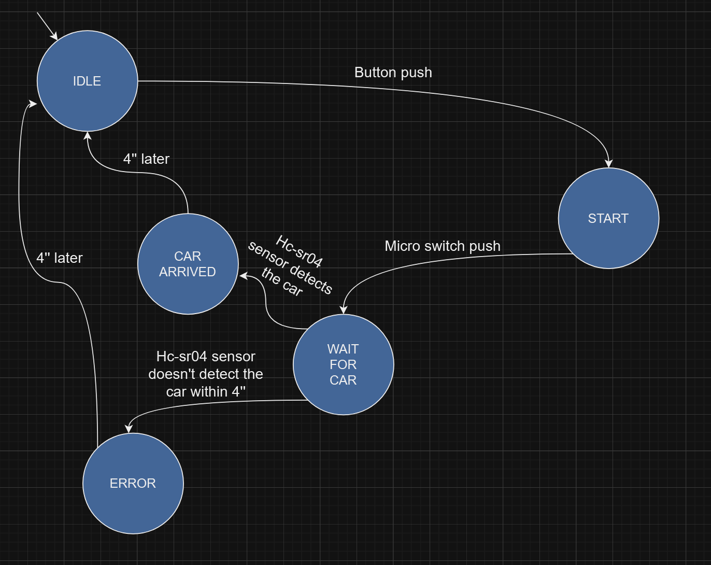
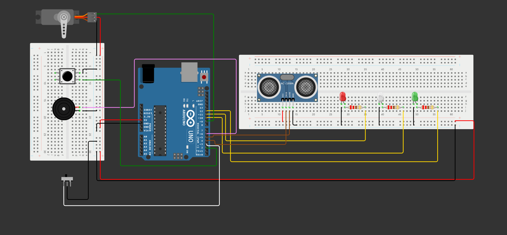
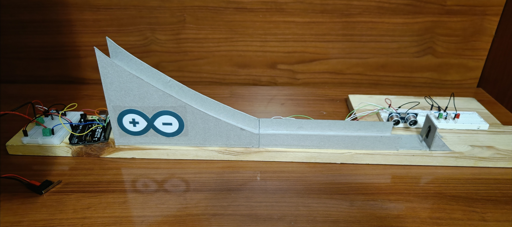
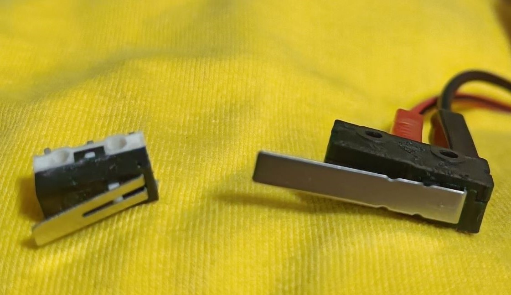
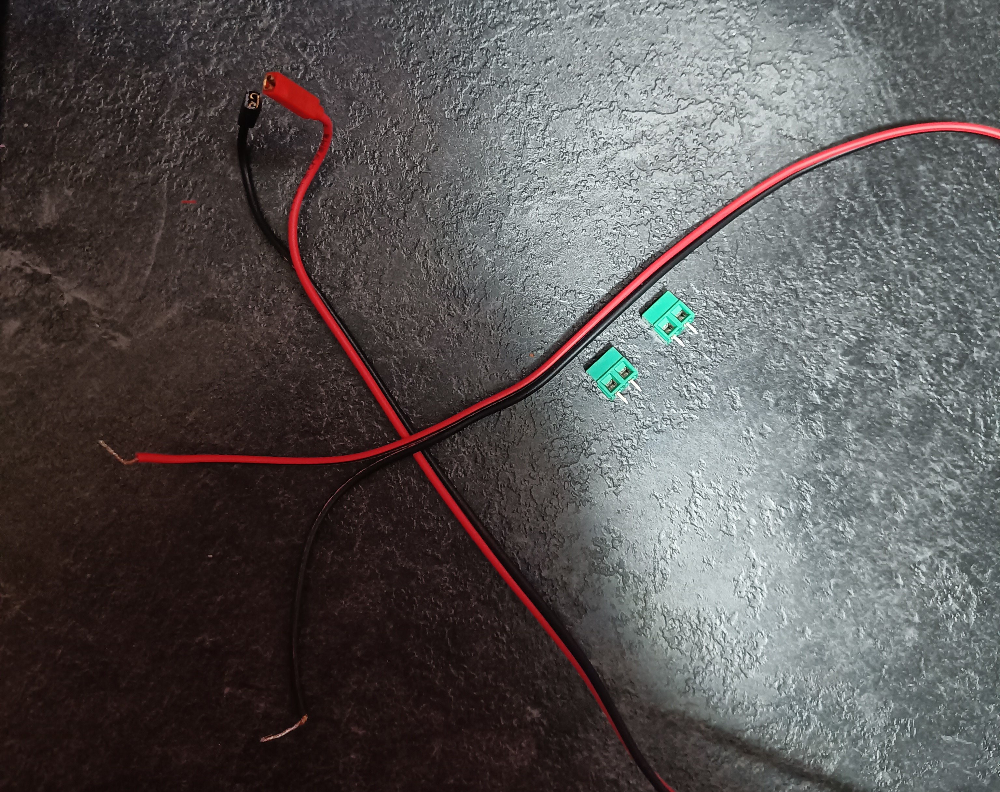

# Mod. RubeG_wheels

Autore: Alessandro Riva

## Descrizione

Il progetto ha lo scopo di essere uno dei moduli della [__macchina Rube-Goldberg__](https://gitlab.di.unimi.it/sistemiembedded/embedded-rube-goldberg), realizzata nel corso dell'anno accademico 2022/23 da parte degli studenti del corso di Sistemi Embedded dell'università degli studi di Milano. 
Il modulo si presenta come una pista per una macchinina (ad esempio Hot-Wheels, da cui il nome), realizzata con cartone vegetale, ottimo materiale da modellare e assemblare. 
Il funzionamento si presenta come segue:
- La presenza del led bianco acceso segnala di caricare la macchina sulla rampa, premere il bottone per segnalare l'avvenuto caricamento.  
  Fatto ciò si accenderà un led verde che segnala che il modulo è pronto ad entrare in funzione.
- Ricevuto input dal modulo precedente, tramite microswitch, il servo motore lascerà cadere la macchina, dopo un countdown segnalato da led e suoni.
- Arrivata sul fondo la presenza della macchina viene rilevata da un sensore hc-sr04 e viene segnalata da un led verde lampeggiante accompagnata da un suono intermittente. 
- La macchina arrivando sul fondo, tocca un altro switch che farà partire il modulo seguente.
- In caso di fallimento del modulo precedente, schiacciare il microswitch per far funzionare il tutto comunque.

## Lista materiali

- 1 x Arduino Uno
- 1 x Hc-sr04, sensore ad ultrasuoni.
- 3 x LEDs
- 1 x Motore microservo
- 2 x Microswitch
- 2 x Connettori faston
- 1 x Bottone
- 1 x Buzzer passivo
- 3 x Resistenza 220 $\Omega$
- 1 x Alimentatore da 12 V, 2 A
- 2 x Terminali pcb
- 5 x Chiodi fermacavo
- 1 x Foglio cartone vegetale 100 x 70 cm, 4 mm spessore 

## Realizzazione

Per la realizzazione del modulo, sono partito dalla costruzione della pista con il cartone vegetale. 
Le dimmensioni possono variare in base alle esigenze, per la discesa ho creato due bordature laterali che permettono alla macchina di seguire il percorso. 
A inizio discesa è presente un ritaglio, dove ho provveduto a inserire il braccio del servo che blocca la partenza naturale della macchina, è importante incollare il servo per garantire affidabilità. 
Sul finale della pista troviamo un sostegno con il compito di fermare la macchina, all'interno è inserito il secondo microswitch (anch'esso incollato con colla acrilica). 
Invece un ritaglio nelle bordature del rettilineo, permette il rilevamento da parte del sensore hc-sr04, della macchina. 
Infine la pista è stata fissata su un asse di legno, sul quale ho posizionato l'elettronica effettuando i vari collegamenti. 
Lo sketch, invece, è stato realizzato con l'ide di Arduino e il relativo linguaggio.

## Macchina a stati finiti (FSM)

Il codice è strutturato come una macchina a stati finiti (FSM), il diagramma che segue mostra gli stati e le transizioni che avvengono.  
- IDLE_STATE: stato caratterizzato da un led bianco acceso, indica il dover caricare la macchina sulla rampa, fatto ciò e premuto il pulsante per confermarlo, avviene la transizione al prossimo stato.  
- START_STATE: presenta un led verde acceso, la macchina è pronta per ricevere l'input del modulo precedente (in caso di fallimento del modulo precedente, premere il microswitch manualmente).  
               Quando si riceve l'input parte un countdown fatto da led e suoni, finito il countdown, il servo lascerà andare la macchina e si passa al prossimo stato.  
- WAIT_FOR_CAR_STATE: uno stato di attesa, se la macchina viene rilevata entro 4 secondi dal sensore hc-sr04 si passa a uno stato di avvenuto arrivo altrimenti si passa ad uno stato di errore.
- ARRIVED_STATE: la macchina è stata rilevata, l'avvenuta rilevazione viene segnalata da un led verde lampeggiante e da un suono intermittente, dopo 4 secondi si torna all'IDLE_STATE.
- ERROR_STATE: la macchina non è stata rilevata entro 4 secondi, i motivi possono essere molteplici (macchina non caricata effettivamente, bloccata sulla rampa, ecc).  
               L'errore dal led rosso lampeggiante e un suono intermittente con frequenza diversa rispetto allo stato di arrivo.  
			   Dopo 4 secondi si torna all'IDLE_STATE.  
			   

## Schema elettrico

## Risultato finale

## Difficoltà riscontrate

### Scelta delle librerie

Per utilizzare il sensore hc-sr04 ho utilizzato la seguente [__libreria__](https://bitbucket.org/teckel12/arduino-new-ping/wiki/Home), per l'uso del buzzer ho sfruttato una [__libreria__](https://bitbucket.org/teckel12/arduino-new-tone/wiki/Home) dallo stesso autore, che evita conflitti in fase di compilazione del codice.  
Per evitare un ulteriore conflitto (riguardante i timer) tra la libreria Servo.h e l'ultima libreria citata, ho usato questa [__libreria per il controllo del motore microservo__](https://github.com/nabontra/ServoTimer2).    

### Costruzione del modulo

La costruzione del modulo stesso è stata una delle maggiori difficoltà riscontrate. 
L'utilizzo del cartone vegetale ha dato resa e stabilità alla pista, ha richiesto però molta precisione e tempo per la realizzazione. 
In quanto ai materiali aggiuntivi, è necessario un cutter (possibilmente di precisione), e vari tipi di colla per assemblare il tutto. 
La richiesta del collega di inserire un micro switch alla fine della pista ha comportato il rifacimento del fondo, che ho rifatto per una terza e ultima volta per risolvere il problema della scelta dello switch. 

### Scelta del microswitch e cablatura

In un primo momento la scelta del modello del microswitch è andata sul modello a sinistra nell'immagine. 
Il seguente modello però non veniva schiacciato bene dalla macchina in corsa quindi ho optato per l'acquisto del modello di destra, che presenta una leva più lunga e facilmente schiacciabile.

Per connettere tale switch alla board Arduino, è necessario avere dei cavi con finali tipo faston, che ho provveduto a realizzare, crimpando e saldando il tutto. 
Per permettere l'inserimento di una delle due estremità nella breadboard ho utilizzato dei terminali pcb.

